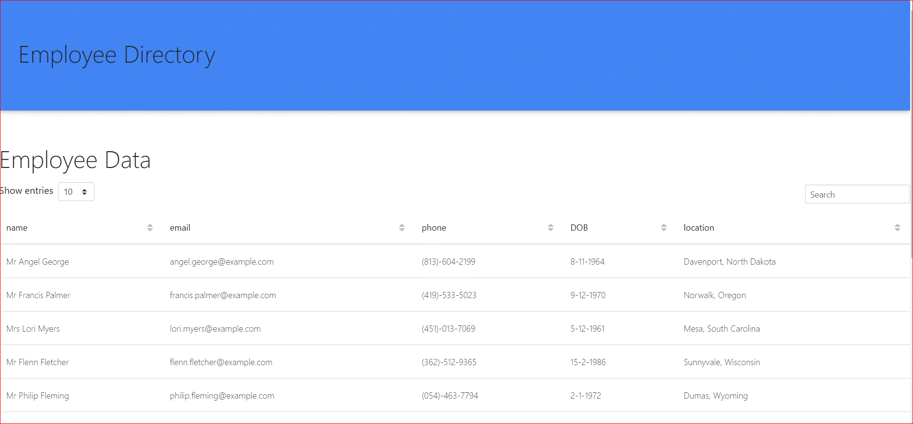

# that-react-employee-directory
Employee directory app created with React web framework.  When the user loads the page, the app renders a table of employees.  The user has the ability to sort the table by category and features a search box that allows the user to filter by property. 

## User Story
As a user, I want to be able to view my entire employee directory at once so that I have quick access to their information.

## Preview

## Deployed Link
https://guarded-coast-73373.herokuapp.com/

## GitHub
https://github.com/jen6one9/that-react-employee-directory
 

## Acknowledgements
The successful release of this application would not be possible without the candid feedback and support of my tutor, class TA's and cohort peers. 

## License 
Copyright 2020 Jeneth Diesta

Permission is hereby granted, free of charge, to any person obtaining a copy of this software and associated documentation files (the "Software"), to deal in the Software without restriction, including without limitation the rights to use, copy, modify, merge, publish, distribute, sublicense, and/or sell copies of the Software, and to permit persons to whom the Software is furnished to do so, subject to the following conditions:

The above copyright notice and this permission notice shall be included in all copies or substantial portions of the Software.

THE SOFTWARE IS PROVIDED "AS IS", WITHOUT WARRANTY OF ANY KIND, EXPRESS OR IMPLIED, INCLUDING BUT NOT LIMITED TO THE WARRANTIES OF MERCHANTABILITY, FITNESS FOR A PARTICULAR PURPOSE AND NONINFRINGEMENT. IN NO EVENT SHALL THE AUTHORS OR COPYRIGHT HOLDERS BE LIABLE FOR ANY CLAIM, DAMAGES OR OTHER LIABILITY, WHETHER IN AN ACTION OF CONTRACT, TORT OR OTHERWISE, ARISING FROM, OUT OF OR IN CONNECTION WITH THE SOFTWARE OR THE USE OR OTHER DEALINGS IN THE SOFTWARE.
